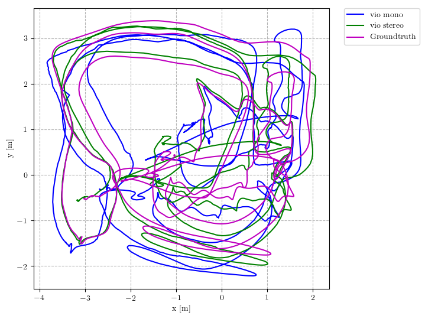
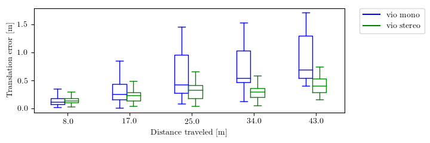

# rpg_trajectory_evaluation

This repository implements common used trajectory evaluation methods for visual(-inertial) odometry. Specifically, it includes
* Different trajectory alignment methods (rigid-body, similarity and yaw-only rotation)
* Commonly used error metrics: Absolute Trajectory Error (ATE) and Relative/Odometry Error (RE)

Since trajectory evaluation involves many details, the toolbox is designed for easy use.
It can be used to analyze a [single trajectory estimate](#single-trajectory-estimate), as well as [compare different algorithms on many datasets](#multiple-trajectory-estimates) (e.g., [this paper](http://rpg.ifi.uzh.ch/docs/ICRA18_Delmerico.pdf)) with one command.
The user only needs to provide the groundtruths and estimates of desired format and specify the trajectory alignment method.
The toolbox generates (almost) paper-ready plots and tables.
In addition, the evaluation can be easily [customized](#customization).

If you use this code in an academic context, please cite the following paper:

Zichao Zhang, Davide Scaramuzza: A Tutorial on Quantitative Trajectory Evaluation for Visual(-Inertial) Odometry, IEEE/RSJ Int. Conf. Intell. Robot. Syst. (IROS), 2018.

```
@InProceedings{Zhang18iros
  author = {Zhang, Zichao and Scaramuzza, Davide},
  title = {A Tutorial on Quantitative Trajectory Evaluation for Visual(-Inertial) Odometry},
  booktitle = {IEEE/RSJ Int. Conf. Intell. Robot. Syst. (IROS)},
  year = {2018}
}
```


1. [Install](#install)
2. [Prepare the Data](#prepare-the-data)
3. [Run the Evaluation](#run-the-evaluation)
   * [Single Trajectory Estimate](#single-trajectory-estimate)
   * [Multiple Trajectory Estimate](#multiple-trajectory-estimates)
4. [Dataset Tools](#dataset-tools)
5. [Customization: `Trajectory` class](#customization)
6. [Credits](#credits)

## Install
The package is written in python and tested in Ubuntu 16.04 and 18.04.
Currently only `python2` is supported.
The package can be used as a ROS package as well as a standalone tool.
To use it as a ROS package, simply clone it into your workspace.
It only depends on [`catkin_simple`](https://github.com/catkin/catkin_simple) to build.

**Dependencies**: You will need `numpy` and `matplotlib` for the analysis/plotting.

## Prepare the Data
Each trajectory estimate (e.g., output of a visual-inertial odometry algorithm) to evaluate is organized as a self-contained folder.
Each folder needs to contain at least two text files specifying the groundtruth and estimated poses with timestamps.

* `stamped_groundtruth.txt`: groundtruth poses with timestamps
* `stamped_traj_estimate.txt`: estimated poses with timestamps
* (optional) `eval_cfg.yaml`: specify evaluation parameters

You can see the folders under `results` for examples.
These three files contains **all the essential information** to reproduce quantitative trajectory evaluation results with the toolbox.

#### Poses
The groundtruth and estimated poses are specified in the following format

```
# timestamp tx ty tz qx qy qz qw
1.403636580013555527e+09 1.258278699999999979e-02 -1.561510199999999963e-03 -4.015300900000000339e-02 -5.131151899999999988e-02 -8.092916900000000080e-01 8.562779200000000248e-04 5.851609599999999523e-01
......
```

Note that the file is space separated, and the quaternion has the `w` component at the end.
The timestamps are in the unit of second and used to establish temporal correspondences.

There are some scripts under `scripts/dataset_tools` to help you convert your data format (EuRoC style, ROS bag) to the above format.
See the corresponding section below for details.

#### Evaluation parameters
Currently `eval_cfg.yaml` specifies two parameters for trajectory alignment (used in absolute errors):
* `align_type`:
  * `sim3`: a similarity transformation (for vision-only monocular case)
  * `se3`: a rigid body transformation (for vision-only stereo case)
  * `posyaw`: a translation plus a rotation around gravity (for visual-inertial case)
  * `none`: do not align the trajectory
* `align_num_frames`: the number of poses (starting from the beginning) that will be used in the trajectory alignment. `-1` means all poses will be used.

**If this file does not exist, trajectory alignment will be done using `sim3` and all the poses.**

## Run the Evaluation
We can run the evaluation on a single estimate result or for multiple algorithms and datasets.

### Single trajectory estimate

As a ROS package, run

```
rosrun rpg_trajectory_evaluation analyze_trajectory_single.py <result_folder>
```

or as a standalone package, run

```
python2 analyze_trajectory_single.py <result_folder> 
```

`<result_folder>` should contain the groundtruth, trajectory estimate and optionally the evaluation configuration as mentioned above.

#### Output
After the evaluation is done, you will find two folders under `<result_folder>`:
* `saved_results`: text files that contains the statistics of different errors
  * `absolute_err_statistics_<align_type>_<align_frames>.yaml`: the statistics of the absolute error using the specified alignment.
  * `relative_error_statistics_<len>.yaml`: the statistics of the relative error calculated using the sub-trajectories of length `<len>`.
  * `cached_rel_err.pickle`: since the relative error is time consuming to compute, we cache the relative error for different sub-trajectory lengths so that we can directly use them next time.
* `plots`: plots of absolute errors, relative (odometry) errors and the trajectories.

Several example plots showing the trajectory, absolute trajectory error and relative error are


#### Parameters
* `--recalculate_errors`: will remove the error cache file mentioned above and re-calculate everything. Default: `False`.
* `--png`: save plots as png instead of pdf. Default: `False`

### Multiple trajectory estimates

For ROS, run

```
rosrun rpg_trajectory_evaluation analyze_trajectories.py \
  --platform <platform> --odometry_error --overall_odometry_error --plot_trajectories --rmse_table
```
otherwise, run

```
python2 analyze_trajectories.py \
  --platform <platform> --odometry_error --overall_odometry_error --plot_trajectories --rmse_table
```

These commands will look for `<platform>` folder under `results` and analyze the algorithms and datasets combinations specified in `analyze_trajectories.py`, as described below.

#### Datasets organization
The datasets under `results` are organized as 

```
<platform>
├── <alg1>
│   ├── <platform>_<alg1>_<dataset1>
│   ├── <platform>_<alg1>_<dataset2>
│   └── ......
└── <alg2>
│   ├── <platform>_<alg2>_<dataset1>
│   ├── <platform>_<alg2>_<dataset2>
    ├── ......
......
```

Each sub-folder is of the same format as mentioned above.
In the script `analyze_trajectories.py`, you need to specify the algorithms and datasets to analyze, for example

```python
ALGORITHM_CONFIGS = ['vio_mono', 'vio_stereo']
DATASETS = ['MH_01', 'MH_03', 'MH_05', 'V2_01', 'V2_02', 'V2_03']
PLOT_LABELS = {'vio_mono': 'vio mono', 'vio_stereo': 'vio stereo'}
```

will analyze the following folders

```
├── vio_mono
│   ├── laptop_vio_mono_MH_01
│   ├── laptop_vio_mono_MH_03
│   ├── laptop_vio_mono_MH_05
│   ├── laptop_vio_mono_V2_01
│   ├── laptop_vio_mono_V2_02
│   └── laptop_vio_mono_V2_03
└── vio_stereo
    ├── laptop_vio_stereo_MH_01
    ├── laptop_vio_stereo_MH_03
    ├── laptop_vio_stereo_MH_05
    ├── laptop_vio_stereo_V2_01
    ├── laptop_vio_stereo_V2_02
    └── laptop_vio_stereo_V2_03
```

Optionally, you can change the following variables in the script for more customization

* `COLORS`: a dictionary specifying the colors for different algorithms. A set of default colors will be generated.
* `MAX_TRAJ_LENGTHS`: a dictionary specifying the maximum trajectory lengths of datasets.
If there is no entry for one dataset, the maximum length will be computed from the groundtruth.
* `OVERALL_BOXPLOT_DISTANCES`: sub-trajectory lengths used to evaluate the relative errors on all the datasets to compute the overall relative error.


#### Output
The evaluation process will generate the `saved_results` folder in each result folder,
same as the evaluation for single trajectory estimate.
In addition, it will generate plots and text files under `results` folder comparing different algorithms:
* `<dataset>_trajectory_side/top.pdf`: plots of the aligned trajectories of different algorithms on `<dataset>`, along with the groundtruth.
* `<dataset>_translation/yaw_error.pdf`: plots of the relative translation and yaw error of different algorithms on `<dataset>`.
* `overall_rel_trans/yaw_error.pdf`: plots of the overall relative error of different algorithms evaluated on all datasets.
* `overall_rel_trans/yaw_err.txt`: tables of the relative error of different algorithms evaluated on all datasets.
* `<platform>_translation_rmse.txt`: table of the translation RMSE (absolute trajectory error) of all datasets and algorithms.

The tables can be readily used in `Latex` files.

Several example plots comparing the performance of different algorithms are




#### Parameters
Paths:
* `--results_dir`: the folder where the `<platform>` folder will be found. Default: `results` folder in the toolbox folder.
* `--output_dir`: the folder for all the plots and text files. Default: `results` folder in the toolbox folder.

Which trajectory estimate to process:
* `--platform`: the folder of results to be found under the `<results_dir>`. Default: `laptop`
* `--alg`: which algorithm to process. Default: `all`, will process all the algorithms specified in the script.
* `--dataset`: which dataset to process. Default: `all`, will process all the datasets specified in the script.

Analysis options:
* `--odometry_error_per_dataset`: whether to compute the relative error for each dataset. Default: `False`.
* `--overall_odometry_error`: whether to compute the overall relative error on all the datasets. Default: `False`.
* `--rmse_table`: whether to generate the table of translation RMSE (absolute error). Default: `False`.
* `--plot_trajectories`: whether to plot trajectories. Default: `False`.

Misc:
* `--recalculate_errors:` whether to clear the cache and recalculate everything. Default: False.
* `--png`: save plots as png instead of pdf. Default: `False`

## Dataset tools
Under `scripts/dataset_tools`, we provide several scripts to prepare your dataset for analysis. Specifically:
* `asl_groundtruth_to_pose.py`: convert EuRoC style format to the format used in this toolbox.
* `bag_to_pose.py`: extract `PoseStamped`/`PoseWithCovarianceStamped` in a ROS bag to the desired format.
* `transform_trajectory.py`: transformed a pose file of our format by a given transformation, useful for applying hand-eye calibration to groundtruth/estimate before analysis.

## Customization
Most of the error computing is done via the class `Trajectory` (`src/rpg_trajectory_evaluation/trajectory.py`).
If you would like to customize your evaluation, you can use this class directly.
The API of this class is quite simple

```python
# init with the result folder.
# You can also specify the subtrajecotry lengths and alignment parameters in the initialization.
traj = Trajectory(result_dir)

# compute the absolute error
traj.compute_absolute_error()

# compute the relative errors at `subtraj_lengths`.
traj.compute_relative_errors(subtraj_lengths)

# compute the relative error at sub-trajectory lengths computed from the whole trajectory length.
traj.compute_relative_errors()

# save the relative error to `cached_rel_err.pickle`
traj.cache_current_error()

# write the error statistics to yaml files
traj.write_errors_to_yaml()

# static method to remove the cached error from a result folder
Trajectory.remove_cached_error(result_dir)
```

After the error is computed, the absolute and relative errors are stored in the trajectory object and can be accessed afterwards:
* absolute error: `traj.abs_errors`.
It is a dictionary stores the absolute errors of all poses as well as their statistics.
See `Trajectory.compute_absolute_error` function for details.

* relative error: `traj.rel_errors`.
It is a dictionary stores the relative errors of different distances (using the distance as the key).
See `Trajectory.compute_relative_error_at_subtraj_len` function for details.

With the interface, it should be easy to access all the computed errors for customized analysis.

## Credits
See `package.yaml` for the list of authors that have contributed to this toolbox.

