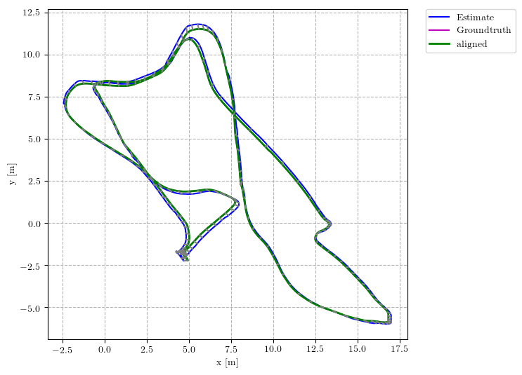
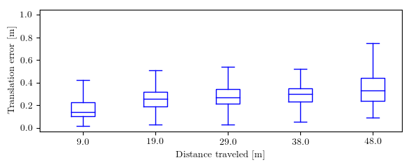
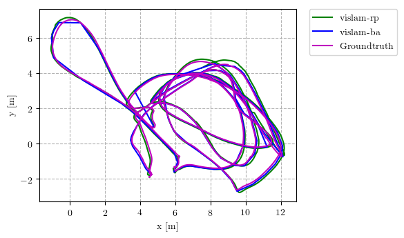
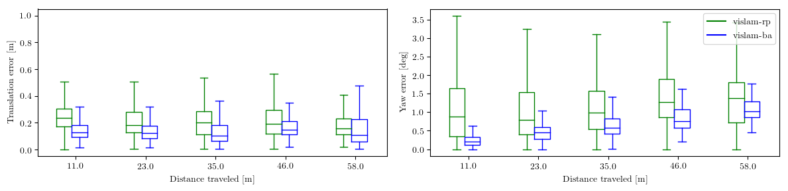

# rpg_trajectory_evaluation

This repository implements common used trajectory evaluation methods for visual(-inertial) odometry. Specifically, it includes
* Different trajectory alignment methods (rigid-body, similarity and yaw-only rotation)
* Commonly used error metrics: Absolute Trajectory Error (ATE) and Relative/Odometry Error (RE)

> The relative error is implemented in the same way as in [KITTI](http://www.cvlibs.net/publications/Geiger2012CVPR.pdf) since it is the most widely used version.

Since trajectory evaluation involves many details, the toolbox is designed for easy use.
It can be used to analyze a [single trajectory estimate](#single-trajectory-estimate), as well as [compare different algorithms on many datasets](#multiple-trajectory-estimates) (e.g., [this paper](http://rpg.ifi.uzh.ch/docs/ICRA18_Delmerico.pdf) and used in [IROS 2019 VIO competition](http://rpg.ifi.uzh.ch/uzh-fpv.html)) with one command.
The user only needs to provide the groundtruths and estimates of desired format and specify the trajectory alignment method.
The toolbox generates (almost) paper-ready plots and tables.
In addition, the evaluation can be easily [customized](#customization).

If you use this code in an academic context, please cite the following paper:

Zichao Zhang, Davide Scaramuzza: A Tutorial on Quantitative Trajectory Evaluation for Visual(-Inertial) Odometry, IEEE/RSJ Int. Conf. Intell. Robot. Syst. (IROS), 2018.

```
@InProceedings{Zhang18iros,
  author = {Zhang, Zichao and Scaramuzza, Davide},
  title = {A Tutorial on Quantitative Trajectory Evaluation for Visual(-Inertial) Odometry},
  booktitle = {IEEE/RSJ Int. Conf. Intell. Robot. Syst. (IROS)},
  year = {2018}
}
```

1. [Install](#install)
2. [Prepare the Data](#prepare-the-data)
   * [Poses](#poses)
   * [Evaluation Parameters](#evaluation-parameters)
   * [Start and end times](#start-and-end-times)
3. [Run the Evaluation](#run-the-evaluation)
   * [Single Trajectory Estimate](#single-trajectory-estimate)
   * [Multiple Trajectory Estimate](#multiple-trajectory-estimates)
4. [Utilities](#utilities)
   * [Dataset Tools](#dataset-tools)
   * [Misc. Scripts](#misc-scripts)
5. [Customization: `Trajectory` class](#customization)
6. [Credits](#credits)

## Install
The package is written in python and tested in Ubuntu 16.04 and 18.04.
Currently only `python2` is supported.
The package can be used as a ROS package as well as a standalone tool.
To use it as a ROS package, simply clone it into your workspace.
It only depends on [`catkin_simple`](https://github.com/catkin/catkin_simple) to build.

**Dependencies**: You will need install the following:

* `numpy` and `matplotlib` for the analysis/plotting
* `colorama` for colored console output
* `ruamel.yaml` ([install](https://pypi.org/project/ruamel.yaml/)) for [preserving the order in yaml configurations](https://stackoverflow.com/questions/5121931/in-python-how-can-you-load-yaml-mappings-as-ordereddicts)

## Prepare the Data
Each trajectory estimate (e.g., output of a visual-inertial odometry algorithm) to evaluate is organized as a self-contained folder.
Each folder needs to contain at least two text files specifying the groundtruth and estimated poses with timestamps.

* `stamped_groundtruth.txt`: groundtruth poses with timestamps
* `stamped_traj_estimate.txt`: estimated poses with timestamps
* (optional) `eval_cfg.yaml`: specify evaluation parameters
* (optional) `start_end_time.yaml`: specify the start and end time (in seconds) for analysis.


For analyzing results from `N` runs, the estimated poses should have suffixes `0` to `N-1`.
You can see the folders under `results` for examples.
These files contains **all the essential information** to reproduce quantitative trajectory evaluation results with the toolbox.

#### Poses
The groundtruth (`stamped_groundtruth.txt`) and estimated poses (`stamped_traj_estimate.txt`) are specified in the following format

```
# timestamp tx ty tz qx qy qz qw
1.403636580013555527e+09 1.258278699999999979e-02 -1.561510199999999963e-03 -4.015300900000000339e-02 -5.131151899999999988e-02 -8.092916900000000080e-01 8.562779200000000248e-04 5.851609599999999523e-01
......
```

Note that the file is space separated, and the quaternion has the `w` component at the end.
The timestamps are in the unit of second and used to establish temporal correspondences.

There are some scripts under `scripts/dataset_tools` to help you convert your data format (EuRoC style, ROS bag) to the above format.
See the corresponding section below for details.

#### Evaluation parameters
Currently `eval_cfg.yaml` specifies two parameters for trajectory alignment (used in absolute errors):
* `align_type`:
  * `sim3`: a similarity transformation (for vision-only monocular case)
  * `se3`: a rigid body transformation (for vision-only stereo case)
  * `posyaw`: a translation plus a rotation around gravity (for visual-inertial case)
  * `none`: do not align the trajectory
* `align_num_frames`: the number of poses (starting from the beginning) that will be used in the trajectory alignment. `-1` means all poses will be used.

**If this file does not exist, trajectory alignment will be done using `sim3` and all the poses.**

#### Start and end times

`start_end_time.yaml` can specify the following (according to groundtruth time):
* `start_time_sec`: only poses after this time will be used for analysis
* `end_time_sec`: only poses before this time will be used for analysis

**If this file does not exist, analysis be done for all the poses in `stamped_traj_estimate.txt`.**


## Run the Evaluation
We can run the evaluation on a single estimate result or for multiple algorithms and datasets.

### Single trajectory estimate

As a ROS package, run

```
rosrun rpg_trajectory_evaluation analyze_trajectory_single.py <result_folder>
```

or as a standalone package, run

```
python2 analyze_trajectory_single.py <result_folder> 
```

`<result_folder>` should contain the groundtruth, trajectory estimate and optionally the evaluation configuration as mentioned above.

#### Output
After the evaluation is done, you will find two folders under `<result_folder>`:
* `saved_results/traj_est`: text files that contains the statistics of different errors
  * `absolute_err_statistics_<align_type>_<align_frames>.yaml`: the statistics of the absolute error using the specified alignment.
  * `relative_error_statistics_<len>.yaml`: the statistics of the relative error calculated using the sub-trajectories of length `<len>`.
  * `cached_rel_err.pickle`: since the relative error is time consuming to compute, we cache the relative error for different sub-trajectory lengths so that we can directly use them next time.
* `plots`: plots of absolute errors, relative (odometry) errors and the trajectories.

For multiple trials, the result for trial `n` will have the corresponding suffix, and the statistics of multiple trials will be summarized in files with the name `mt_*`.

As an example, after executing:
```
python2 scripts/analyze_trajectory_single.py results/euroc_mono_stereo/laptop/vio_mono/laptop_vio_mono_MH_05
```
you will find the following in `plots`:





#### Parameters
* `--recalculate_errors`: will remove the error cache file mentioned above and re-calculate everything. Default: `False`.
* `--png`: save plots as png instead of pdf. Default: `False`
* `--mul_trials`: will analyze `n` runs. In the case of `n > 1`, the estimate files should end with a number suffix (e.g., `stamped_traj_estimate0.txt`). Default: `None`

#### Advanced: Different estimation type
Sometimes, a SLAM algorithm outputs different types of trajectories, such as real-time poses and optimized keyframe poses (e.g., pose graph, bundle adjustment). By specifying the estimation type (at the end of the command line), you can ask the script to analyze different files, for example
* `--est_type traj_est`: analyze `stamped_traj_estimate.txt`
* `--est_type pose_graph`: analyze `stamped_pose_graph_estimate.txt`
* `--est_type traj_est pose_graph`: analyze both. In this case you can find the results in corresponding sub-directories in `saved_results` and `plots`.

The mapping from the `est_type` to file names (i.e., `stamped_*.txt`) is defined in `scripts/fn_constants.py`. This is also used for analyzing multiple trajectories. You can find an example in `results/euroc_vislam_mono` for comparing real-time poses and bundle adjustment estimates.

### Multiple trajectory estimates

Similar to the case of single trajectory evaluation, for ROS, run

```
rosrun rpg_trajectory_evaluation analyze_trajectories.py \
  euroc_vislam_mono.yaml --output_dir=./results/euroc_vislam_mono --results_dir=./results/euroc_vislam_mono --platform laptop --odometry_error_per_dataset --plot_trajectories --rmse_table --rmse_boxplot --mul_trials=10
```
otherwise, run

```
python2 scripts/analyze_trajectories.py \
  euroc_vislam_mono.yaml --output_dir=./results/euroc_vislam_mono --results_dir=./results/euroc_vislam_mono --platform laptop --odometry_error_per_dataset --plot_trajectories --rmse_table --rmse_boxplot --mul_trials=10
```

These commands will look for `<platform>` folder under `results_dir` and analyze the algorithms and datasets combinations specified in `analyze_trajectories.py`, as described below.

#### Datasets organization
The datasets under `results` are organized as 

```
<platform>
├── <alg1>
│   ├── <platform>_<alg1>_<dataset1>
│   ├── <platform>_<alg1>_<dataset2>
│   └── ......
└── <alg2>
│   ├── <platform>_<alg2>_<dataset1>
│   ├── <platform>_<alg2>_<dataset2>
    ├── ......
......
```

Each sub-folder is of the same format as mentioned above.
You need to specify the algorithms and datasets to analyze for the script `analyze_trajectories.py`.
We use a configuration file under `scripts/analyze_trajectories_config` to sepcify the details. For example, in `euroc_vio_mono_stereo.yaml`

```
Datasets:
  MH_01:        ---> dataset name
    label: MH01 ---> plot label for the dataset
  MH_03:
    label: MH03
  MH_05:
    label: MH05
  V2_01:
    label: V201
  V2_02:
    label: V202
  V2_03:
    label: V203
Algorithms:
  vio_mono:         ---> algorithm name
    fn: traj_est    ---> estimation type to find the correct file name
    label: vio_mono ---> plot label for the algorithm
  vio_stereo: 
    fn: traj_est
    label: vio_stereo
RelDistances: []   ---> used to specify the sub-trajectory lengths in the relative error, see below.
RelDistancePercentages: []
```

will analyze the following folders

```
├── vio_mono
│   ├── laptop_vio_mono_MH_01
│   ├── laptop_vio_mono_MH_03
│   ├── laptop_vio_mono_MH_05
│   ├── laptop_vio_mono_V2_01
│   ├── laptop_vio_mono_V2_02
│   └── laptop_vio_mono_V2_03
└── vio_stereo
    ├── laptop_vio_stereo_MH_01
    ├── laptop_vio_stereo_MH_03
    ├── laptop_vio_stereo_MH_05
    ├── laptop_vio_stereo_V2_01
    ├── laptop_vio_stereo_V2_02
    └── laptop_vio_stereo_V2_03
```

##### Specifying sub-trajectory lengths for relative pose errors
The relative pose error is calculated from subtrajectories of different lengths, which can be specified by the following fields in the configuration file
* `RelDistances`: a set of lengths that will be used for all the datasets
* `RelDistancePercentages`: the lengths will be selected independently as certain percentages of the total length for each dataset. **This will be overwritten by `RelDistances`**.
If none of the above is specified, the default percentages (see `src/trajectory.py`) will be used.


#### Output
The evaluation process will generate the `saved_results` folder in each result folder,
same as the evaluation for single trajectory estimate.
In addition, it will generate plots and text files under `results` folder comparing different algorithms:
* Under `<platform>_<dataset>_results` folder you can find the trajectory top/side views and the boxplots of the relative pose errors on this dataset.
* `all_translation/rotation_rmse.pdf`: boxplots of the RMSE of multiple runs for all datasets.
* `<platform>_translation_rmse<algorithm_dataset_string>.txt`: `Latex` table summarizing the RMSE of all configurations. `<algorithm_dataset_string>` is an identifier generated from the algorithms and datasets evaluated. The values in the table are formated as `mean, median (min, max)` from the errors of multiple trials.

The tables can be readily used in `Latex` files.

Several example plots (from `analyze_trajectories_config/euroc_vislam_mono.yaml`) comparing the performance of different algorithms are




#### Parameters
Configuration:
* `config` configuration file under `scripts/analyze_trajectories_config`

Paths:
* `--results_dir`: the folder where the `<platform>` folder will be found. Default: `results` folder in the toolbox folder.
* `--output_dir`: the folder for all the plots and text files. Default: `results` folder in the toolbox folder.
* `--platform`: the folder of results to be found under the `<results_dir>`. Default: `laptop`

Analysis options:
* `--mul_trials`: how many trials we want to analyze. Default: `None`. If some algorithm-dataset configuration has less runs, only the available ones will be considered.

* `--odometry_error_per_dataset`: whether to compute the relative error for each dataset. Default: `False`.
* `--overall_odometry_error`: whether to compute and compare the overall odometry error on all datasets for different algorithms. Default: `False`.

* `--rmse_table`: whether to generate the table of translation RMSE (absolute error). Default: `False`.
  * `--rmse_table_median_only`: per default, the `--rmse_table` option saves median/mean/min/max of multiple runs. Use this option to only save the median.
  * `--rmse_boxplot`: whether to plot boxplot for RMSE of different datasets (only valid for analysing results from multiple trials). Default: `False`.

* `--plot_trajectories`: whether to plot trajectories. Default: `False`. By default, many plots are generated, and some of them can be turned off by the following options.
  * `--no_plot_side`: do not plot side views
  * `--no_plot_aligned`: do not plot the alignment connection between the groundtruth and estimate
  * `--no_plot_traj_per_alg`: do not generate plots for each algorithm

Misc:
* `--recalculate_errors:` whether to clear the cache and recalculate everything. Default: `False`.
* `--png`: save plots as png instead of pdf. Default: `False`
* `--dpi`: allow saving at a higher dpi. Default: 300
* `--no_sort_names`: do not sort the names of datasets and algorithms (using the order in the configuration file) when plotting/writing the results. Default: names will be sorted.

## Utilities

### Dataset tools
Under `scripts/dataset_tools`, we provide several scripts to prepare your dataset for analysis. Specifically:
* `asl_groundtruth_to_pose.py`: convert EuRoC style format to the format used in this toolbox.
* `bag_to_pose.py`: extract `PoseStamped`/`PoseWithCovarianceStamped` in a ROS bag to the desired format.
* `transform_trajectory.py`: transformed a pose file of our format by a given transformation, useful for applying hand-eye calibration to groundtruth/estimate before analysis.

### Misc scripts
Under `scripts`, there are also some scripts for conveniece:
* `recursive_clean_results_dir.py`: remove all `saved_results` directories recursively.
* `change_eval_cfg_recursive.py`: recursively changing the evaluation parameter within a given result folder.

## Customization
Most of the error computing is done via the class `Trajectory` (`src/rpg_trajectory_evaluation/trajectory.py`).
If you would like to customize your evaluation, you can use this class directly.
The API of this class is quite simple

```python
# init with the result folder.
# You can also specify the subtrajecotry lengths and alignment parameters in the initialization.
traj = Trajectory(result_dir)

# compute the absolute error
traj.compute_absolute_error()

# compute the relative errors at `subtraj_lengths`.
traj.compute_relative_errors(subtraj_lengths)

# compute the relative error at sub-trajectory lengths computed from the whole trajectory length.
traj.compute_relative_errors()

# save the relative error to `cached_rel_err.pickle`
traj.cache_current_error()

# write the error statistics to yaml files
traj.write_errors_to_yaml()

# static method to remove the cached error from a result folder
Trajectory.remove_cached_error(result_dir)
```

After the error is computed, the absolute and relative errors are stored in the trajectory object and can be accessed afterwards:
* absolute error: `traj.abs_errors`.
It is a dictionary stores the absolute errors of all poses as well as their statistics.
See `Trajectory.compute_absolute_error` function for details.

* relative error: `traj.rel_errors`.
It is a dictionary stores the relative errors of different distances (using the distance as the key).
See `Trajectory.compute_relative_error_at_subtraj_len` function for details.

With the interface, it should be easy to access all the computed errors for customized analysis.

## Credits
See `package.yaml` for the list of authors that have contributed to this toolbox.

It might happen that some open-source code is incorporated into the toolbox but we missed the license/copyright information.
If you recognize such a situation, please open an issue.
